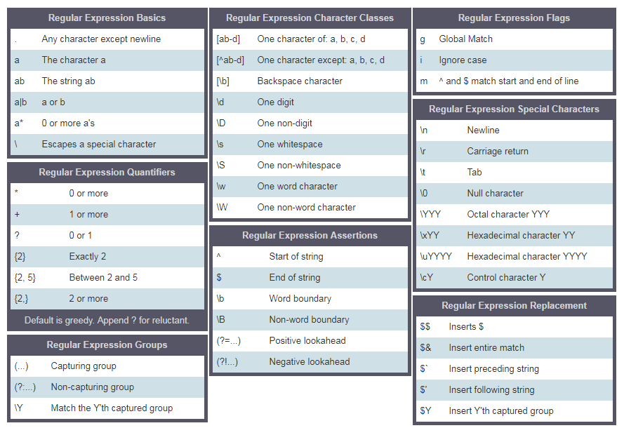

<div align="center">
<h1>30 Günde JavaScript: Düzenli İfadeler</h1>

<a class="header-badge" target="_blank" href="https://x.com/Asabeneh">

</a><br>

<sub>Yazar:
<a href="https://github.com/Asabeneh">Asabeneh Yetayeh</a><br>
<small> Mayıs, 2023</small>
</sub>

</div>

[<< Gün 11](../10_Gün_Setler_ve_Haritalar/10_gün_setler_ve_haritalar.md) | [Gün 13 >>](../13_Gün_Konsol_Nesne_Metodları/13_gün_konsol_nesne_metodları.md)

- [📔 Gün 12](#-Gün-12)
  - [Düzenli İfadeler](#Düzenli-ifadeler)
  - [RegExp Parametreleri](#RegExp-Parameterleri)
  - [Desen](#Desen)
  - [Bayraklar](#Bayraklar)
  - [RegExp Yapıcı ile Bir Model Oluşturma](#RegExp-Yapıcı-ile-Bir-Model-Oluşturma)
  - [Düzenli İfade Oluşturucusu Olmadan Bir Model Oluşturma](#Düzenli-İfade-Oluşturucusu-Olmadan-Bir-Model-Oluşturma)
  - [RegExpp Nesne Yöntemleri](#RegExpp-Nesne-Yöntemleri)
  - [Eşleşme Testi](#Eşleşme-Testi)
  - [Matchın Tamamını İçeren Dizi](#Matchın-Tamamını-İçeren-Dizi)
  - [Bir Alt Dizenin Değiştirilmesi](#Bir-Alt-Dizenin-Değiştirilmesi)
  - [Köşeli Parantez](#Köşeli-Parantez)
  - [Düzenli İfadede Kaçış Karakteri](#Düzenli-İfadede-Kaçış-Karakteri)
  - [Bir veya Daha Fazla Kez](#Bir-veya-Daha-Fazla-Kez)
  - [Nokta](#Nokta)
  - [Sıfır eya Daha Fazla Kez](#Sıfır-veya-Daha-Fazla-Kez)
  - [Sıfır veya Bir Kez](#Sıfır-veya-Bir-Kez)
  - [Düzenli İfadede Nicelik Belirleyici](#Düzenli-İfadede-Nicelik-Belirleyici)
  - [Sepet](#Sepet)
  - [Tam Eşleşme](#Tam-Eşleşme)
- [💻 Gün 12: Egzersizleri](#-Gün-12-Egzersizleri)
  - [Egzersiz: Seviye 1](#Egzersiz-seviye-1)
  - [Egzersiz: Seviye 2](#Egzersiz-seviye-2)
  - [Egzersiz: Seviye 3](#Egzersiz-seviye-3)

# 📔 Gün 12

## Düzenli ifadeler

Düzenli ifade veya RegExp, verilerde kalıp bulmaya yardımcı olan küçük bir programlama dilidir. Bir RegExp, farklı veri türlerinde bazı modellerin olup olmadığını kontrol etmek için kullanılabilir. RegExp'i JavaScript'te kullanmak için ya RegExp yapıcısını kullanırız ya da iki eğik çizgi ve ardından bir bayrak kullanarak bir RegExp kalıbı ilan edebiliriz. Bir deseni iki şekilde oluşturabiliriz.

Bir dizgiyi bildirmek için tek bir alıntı kullanırız, normal bir ifadeyi bildirmek için çift tırnak işareti ve bir ters tik kullanırız, iki eğik çizgi ve isteğe bağlı bir bayrak kullanırız. Bayrak g, i, m, s, u veya y olabilir.

### RegExp Parametreleri

Normal bir ifade iki parametre alır. Gerekli bir arama deseni ve isteğe bağlı bir işaret.

#### Model

Bir kalıp, bir metin veya bir çeşit benzerlik gösteren herhangi bir kalıp olabilir. Örneğin, bir e-postadaki spam kelimesi, bir e-postada aramakla ilgilendiğimiz bir kalıp olabilir veya bir telefon numarası biçimindeki numara, aramakla ilgilenebileceğimiz bir şey olabilir.

#### Bayraklar

Bayraklar, normal bir ifadede arama türünü belirleyen isteğe bağlı parametrelerdir. Bazı bayrakları görelim:

- g: tüm metinde bir model aramak anlamına gelen global bir bayrak
- i: büyük/küçük harf duyarsız bayrağı (hem küçük hem de büyük harfleri arar)
- m: çok satırlı

### RegExp Yapıcı ile Kalıp Oluşturma

Genel işaret ve büyük/küçük harfe duyarsız işaret olmadan düzenli ifade bildirmek.

```js
// without flag
let pattern = "love";
let regEx = new RegExp(pattern);
```

Genel işaret ve büyük/küçük harf duyarsız işaret ile düzenli ifade bildiriyor.

```js
let pattern = "love";
let flag = "gi";
let regEx = new RegExp(pattern, flag);
```

RegExp nesnesini kullanarak bir normal ifade kalıbı bildirme. Düzeni ve bayrağı RegExp yapıcısının içine yazmak

```js
let regEx = new RegExp("love", "gi");
```

### RegExp Yapıcı Olmadan Kalıp Oluşturma

Genel işaret ve büyük/küçük harf duyarsız işaret ile düzenli ifade bildiriyor.

```js
let regEx = /love/gi;
```

Yukarıdaki düzenli ifade, RegExp yapıcısı ile oluşturduğumuz ile aynıdır.

```js
let regEx = new RegExp("love", "gi");
```

### RegExpp Nesne Yöntemleri

Bazı RegExp yöntemlerini görelim

#### Eşleşme Testi

_test()_: Bir dizide eşleşme olup olmadığını test eder. True veya false döndürür.

```js
const str = "I love JavaScript";
const pattern = /love/;
const result = pattern.test(str);
console.log(result);
```

```sh
true
```

#### Matchın Tamamını İçeren Dizi

_match()_: Yakalama grupları da dahil olmak üzere tüm eşleşmeleri içeren bir dizi döndürür veya eşleşme bulunamazsa null değerini döndürür.
Global bir bayrak kullanmıyorsak, match(), kalıbı, indeksi, girişi ve grubu içeren bir dizi döndürür.

```js
const str = "I love JavaScript";
const pattern = /love/;
const result = str.match(pattern);
console.log(result);
```

```sh
["love", index: 2, input: "I love JavaScript", groups: undefined]
```

```js
const str = "I love JavaScript";
const pattern = /love/g;
const result = str.match(pattern);
console.log(result);
```

```sh
["love"]
```

_search()_: Bir dizide eşleşme olup olmadığını test eder. Eşleşmenin dizinini veya arama başarısız olursa -1'i döndürür.

```js
const str = "I love JavaScript";
const pattern = /love/g;
const result = str.search(pattern);
console.log(result);
```

```sh
2
```

#### Bir Alt Diziyi Değiştirme

_replace()_: Bir dizgede eşleşme için bir arama yürütür ve eşleşen alt dizgiyi yeni bir alt dizgiyle değiştirir.

```js
const txt =
  "Python is the most beautiful language that a human begin has ever created.\
I recommend python for a first programming language";

matchReplaced = txt.replace(/Python|python/, "JavaScript");
console.log(matchReplaced);
```

```sh
JavaScript is the most beautiful language that a human begin has ever created.I recommend python for a first programming language
```

```js
const txt =
  "Python is the most beautiful language that a human begin has ever created.\
I recommend python for a first programming language";

matchReplaced = txt.replace(/Python|python/g, "JavaScript");
console.log(matchReplaced);
```

```sh
JavaScript is the most beautiful language that a human begin has ever created.I recommend JavaScript for a first programming language
```

```js
const txt =
  "Python is the most beautiful language that a human begin has ever created.\
I recommend python for a first programming language";

matchReplaced = txt.replace(/Python/gi, "JavaScript");
console.log(matchReplaced);
```

```sh
JavaScript is the most beautiful language that a human begin has ever created.I recommend JavaScript for a first programming language
```

```js
const txt =
  "%I a%m te%%a%%che%r% a%n%d %% I l%o%ve te%ach%ing.\
T%he%re i%s n%o%th%ing as m%ore r%ewarding a%s e%duc%at%i%ng a%n%d e%m%p%ow%er%ing \
p%e%o%ple.\
I fo%und te%a%ching m%ore i%n%t%er%%es%ting t%h%an any other %jobs.\
D%o%es thi%s m%ot%iv%a%te %y%o%u to b%e a t%e%a%cher.";

matches = txt.replace(/%/g, "");
console.log(matches);
```

```sh
I am teacher and  I love teaching.There is nothing as more rewarding as educating and empowering people.I found teaching more interesting than any other jobs.Does this motivate you to be a teacher.
```

- []: Bir dizi karakter
  - [a-c], a veya b veya c anlamına gelir
  - [a-z], a'dan z'ye herhangi bir harf anlamına gelir
  - [A-Z], A'dan Z'ye herhangi bir karakter anlamına gelir
  - [0-3], 0 veya 1 veya 2 veya 3 anlamına gelir
  - [0-9], 0 ile 9 arasındaki herhangi bir sayı anlamına gelir
  - [A-Za-z0-9] a'dan z'ye, A'dan Z'ye, 0'dan 9'a kadar olan herhangi bir karakter
- \\: özel karakterlerden kaçmak için kullanır
  - \d anlamı: dizenin rakamları (0-9 arası sayılar) içerdiği yerle eşleşir
  - \D demek: dizenin rakam içermediği eşleşme
- . : yeni satır karakteri(\n) dışında herhangi bir karakter
- ^: ile başlar
  - r'^substring', örneğin r'^love', aşk kelimesiyle başlayan bir cümle
  - r'[^abc] a değil, b değil, c değil anlamına gelir.
- $: ile biter
  - r'substring$', örneğin r'love$', cümle love kelimesiyle biter
- \*: sıfır veya daha fazla kez
  - r'[a]\*' isteğe bağlı anlamına gelir veya birçok kez olabilir.
- +: bir veya daha fazla kez
  - r'[a]+', en az bir veya daha fazla kez anlamına gelir
- ?: sıfır veya bir kez
  - r'[a]?' sıfır kez veya bir kez anlamına gelir
- \b: kelime sınırlayıcı, bir kelimenin başı veya sonu ile eşleşir
- {3}: Tam olarak 3 karakter
- {3,}: En az 3 karakter
- {3,8}: 3 ila 8 karakter
- |: Ya veya
  - r'elma|muz', elma veya muz anlamına gelir
- (): Yakala ve grupla



Yukarıdaki meta karakterleri açıklığa kavuşturmak için örnek kullanalım

### Köşeli Parantez

Küçük ve büyük harfleri dahil etmek için köşeli parantez kullanalım

```js
const pattern = "[Aa]pple"; // bu köşeli parantez ya A anlamına gelir ya da bir
const txt =
  "Apple and banana are fruits. An old cliche says an apple a day keeps the  doctor way has been replaced by a banana a day keeps the doctor far far away. ";
const matches = txt.match(pattern);

console.log(matches);
```

```sh
["Apple", index: 0, input: "Apple and banana are fruits. An old cliche says an apple a day keeps the  doctor way has been replaced by a banana a day keeps the doctor far far away.", groups: undefined]

```

```js
const pattern = /[Aa]pple/g; // bu köşeli parantez ya A anlamına gelir ya da bir
const txt =
  "Apple and banana are fruits. An old cliche says an apple a day a doctor way has been replaced by a banana a day keeps the doctor far far away. ";
const matches = txt.match(pattern);

console.log(matches);
```

```sh
["Apple", "apple"]
```

Muzu aramak istiyorsak kalıbı şu şekilde yazıyoruz:

```js
const pattern = /[Aa]pple|[Bb]anana/g; // // bu köşeli parantez A veya a anlamına gelir
const txt =
  "Apple and banana are fruits. An old cliche says an apple a day a doctor way has been replaced by a banana a day keeps the doctor far far away. Banana is easy to eat too.";
const matches = txt.match(pattern);

console.log(matches);
```

```sh
["Apple", "banana", "apple", "banana", "Banana"]
```

Köşeli parantez ve veya operatörünü kullanarak Elma, elma, Muz ve muzu çıkarmayı başarıyoruz.

### Düzenli İfadede Kaçış Karakteri

```js
const pattern = /\d/g; // rakam anlamına gelen özel bir karakterdir
const txt = "Bu düzenli ifade örneği 12 Ocak 2020de yapılmıştır.";
const matches = txt.match(pattern);

console.log(matches); // ["1", "2", "2", "0", "2", "0"],istediğimiz bu değil
```

```js
const pattern = /\d+/g; // rakam anlamına gelen özel bir karakterdir
const txt = "Bu düzenli ifade örneği 12 Ocak 2020de yapılmıştır.";
const matches = txt.match(pattern);

console.log(matches); // ["12", "2020"], istediğimiz bu değil
```

### Bir veya Daha Fazla Kez

```js
const pattern = /\d+/g; // rakam anlamına gelen özel bir karakterdir
const txt = 'Bu normal ifade örneği 12 Ocak 2020'de yapılmıştır.';
const matches = txt.match(pattern);
console.log(matches); // ["12", "2020"], istediğimiz bu değil
```

### Dönem

```js
const pattern = /[a]./g; // // bu köşeli parantez a ve anlamına gelir. yeni satır dışında herhangi bir karakter anlamına gelir
const txt = "Elma ve muz meyvelerdir";
const matches = txt.match(pattern);

console.log(matches); // ["an", "an", "an", "a ", "ar"]
```

```js
const pattern = /[a].+/g; // // . herhangi bir karakter, + herhangi bir karakter bir veya daha fazla kez
const txt = "Elma ve muz meyvelerdir";
const matches = txt.match(pattern);

console.log(matches); // ['ve muz meyvedir']
```

### Sıfır veya Daha Fazla Kez

Sıfır veya birçok kez. Model oluşmayabilir veya birçok kez ortaya çıkabilir.

```js
const pattern = /[a].*/g; //. herhangi bir karakter, + herhangi bir karakter bir veya daha fazla kez
const txt = "Elma ve muz meyvelerdir";
const matches = txt.match(pattern);

console.log(matches); // ['ve muz meyvedir']
```

### Sıfır veya Bir Kez

Sıfır veya bir kez. Model oluşmayabilir veya bir kez oluşabilir.

```js
const txt =
  "E-posta kelimesinin nasıl yazılacağına dair bir kural olup olmadığından emin değilim.\
Bazı insanlar bunu e-posta olarak yazar, diğerleri ise E-posta veya E-posta olarak yazabilir.";
const pattern = /[Ee]-?mail/g; // ? isteğe bağlı anlamına gelir
matches = txt.match(pattern);

console.log(matches); // ["e-posta", "e-posta", "E-posta", "E-posta"]
```

### Düzenli İfadede Nicelik Belirleyici

Bir metinde aradığımız alt dizginin uzunluğunu süslü parantez kullanarak belirtebiliriz. RegExp nicelik belirteçlerini nasıl kullanacağımızı görelim. Düşünün, uzunluklarının 4 karakter olduğu alt dizeyle ilgileniyoruz

```js
const txt = "This regular expression example was made in December 6,  2019";
const pattern = /\\b\w{4}\b/g; // tam olarak dört karakterli kelime
const matches = txt.match(pattern);
console.log(matches); // ['This', 'made', '2019']
```

```js
const txt = "This regular expression example was made in December 6,  2019";
const pattern = /\b[a-zA-Z]{4}\b/g; // sayıları olmayan tam olarak dört karakterli kelime
const matches = txt.match(pattern);
console.log(matches); //['This', 'made']
```

```js
const txt = "This regular expression example was made in December 6,  2019";
const pattern = /\d{4}/g; // bir sayı ve tam olarak dört basamak
const matches = txt.match(pattern);
console.log(matches); // ['2019']
```

```js
const txt = "This regular expression example was made in December 6,  2019.";
const pattern = /\d{1,4}/g; // 1 den 4e
const matches = txt.match(pattern);
console.log(matches); // ['6', '2019']
```

### Sepet

- İle başlar

```js
const txt = "This regular expression example was made in December 6,  2019.";
const pattern = /^This/; // ^ ile başlayan anlamına gelir
const matches = txt.match(pattern);
console.log(matches); // ['This']
```

- olumsuzlama

```js
const txt = "This regular expression example was made in December 6,  2019.";
const pattern = /[^A-Za-z,. ]+/g; // ^ set karakteri olumsuzlama anlamına gelir, A'dan Z'ye değil, a'dan z'ye değil, boşluk yok, virgül yok nokta yok
const matches = txt.match(pattern);
console.log(matches); // ["6", "2019"]
```

### Tam Eşleşme

Başlangıcı ^ ve sonu olan $ olmalıdır.

```js
let pattern = /^[A-Z][a-z]{3,12}$/;
let name = "Khatai";
let result = pattern.test(name);

console.log(result); // true
```

🌕Uzağa gidiyorsun. Devam etmek! Şimdi, düzenli ifadenin gücüyle süper yüklüsünüz. Her türlü metni çıkarma ve temizleme gücüne sahipsiniz ve yapılandırılmamış verilerden anlam çıkarabilirsiniz. 12. gün zorluklarını yeni tamamladınız ve mükemmelliğe giden yolda 12 adım öndesiniz. Şimdi beyniniz ve kaslarınız için bazı egzersizler yapın.

## 💻 Gün 12: Egzersizleri

### Egzersiz: Seviye 1

1. Aşağıdaki metinden kişinin toplam yıllık gelirini hesaplayınız. ‘Aylık maaştan 4000 euro, yıllık 10000 euro ikramiye, ayda 5500 euro online kurs kazanıyor.’
2. Bazı parçacıkların yatay x ekseni üzerindeki konumu -12, -4, -3 ve -1 negatif yönde, 0 orijinde, 4 ve 8 pozitif yönde. Bu sayıları çıkarın ve en uzak iki parçacık arasındaki mesafeyi bulun.

```js
points = ["-1", "2", "-4", "-3", "-1", "0", "4", "8"];
sortedPoints = [-4, -3, -1, -1, 0, 2, 4, 8];
distance = 12;
```

3.  Bir dizenin geçerli bir JavaScript değişkeni olup olmadığını belirleyen bir kalıp yazın

        ```sh
        is_valid_variable('first_name') # True
        is_valid_variable('first-name') # False
        is_valid_variable('1first_name') # False
        is_valid_variable('firstname') # True
        ```

### Egzersiz: Seviye 2

1. Bir dizgeden en sık kullanılan on kelimeyi alan _tenMostFrequentWords_ adlı bir işlev yazın?

```js
paragraph = `I love teaching. If you do not love teaching what else can you love. I love Python if you do not love something which can give you all the capabilities to develop an application what else can you love.`;
console.log(tenMostFrequentWords(paragraph));
```

```sh
    [
    {word:'love', count:6},
    {word:'you', count:5},
    {word:'can', count:3},
    {word:'what', count:2},
    {word:'teaching', count:2},
    {word:'not', count:2},
    {word:'else', count:2},
    {word:'do', count:2},
    {word:'I', count:2},
    {word:'which', count:1},
    {word:'to', count:1},
    {word:'the', count:1},
    {word:'something', count:1},
    {word:'if', count:1},
    {word:'give', count:1},
    {word:'develop',count:1},
    {word:'capabilities',count:1},
    {word:'application', count:1},
    {word:'an',count:1},
    {word:'all',count:1},
    {word:'Python',count:1},
    {word:'If',count:1}]
```

```js
console.log(tenMostFrequentWords(paragraph, 10));
```

```sh
[{word:'love', count:6},
{word:'you', count:5},
{word:'can', count:3},
{word:'what', count:2},
{word:'teaching', count:2},
{word:'not', count:2},
{word:'else', count:2},
{word:'do', count:2},
{word:'I', count:2},
{word:'which', count:1}
]
```

### Egzersiz: Seviye 3

1. Metni temizleyen bir fonksiyon yazın. Aşağıdaki metni temizleyin. Temizledikten sonra, dizide en sık kullanılan üç kelimeyi sayın.

```js
sentence = `%I $am@% a %tea@cher%, &and& I lo%#ve %tea@ching%;. There $is nothing; &as& mo@re rewarding as educa@ting &and& @emp%o@wering peo@ple. ;I found tea@ching m%o@re interesting tha@n any other %jo@bs. %Do@es thi%s mo@tivate yo@u to be a tea@cher!?`;
console.log(cleanText(sentence));
```

```sh
Ben bir öğretmenim ve öğretmeyi seviyorum İnsanları eğitmek ve güçlendirmek kadar ödüllendirici bir şey yok Öğretmenliği diğer tüm işlerden daha ilginç buldum Bu sizi öğretmen olmaya motive ediyor mu?
```

2. En çok kullanılan kelimeleri bulan bir fonksiyon yazınız. Temizledikten sonra, dizide en sık kullanılan üç kelimeyi sayın.

```js
console.log(mostFrequentWords(cleanedText))[
  ({ word: "I", count: 3 },
  { word: "teaching", count: 2 },
  { word: "teacher", count: 2 })
];
```

🎉 TEBRİKLER! 🎉

[<< Gün 11](../10_Gün_Setler_ve_Haritalar/10_gün_setler_ve_haritalar.md) | [Gün 13 >>](../13_Gün_Konsol_Nesne_Metodları/13_gün_konsol_nesne_metodları.md)
