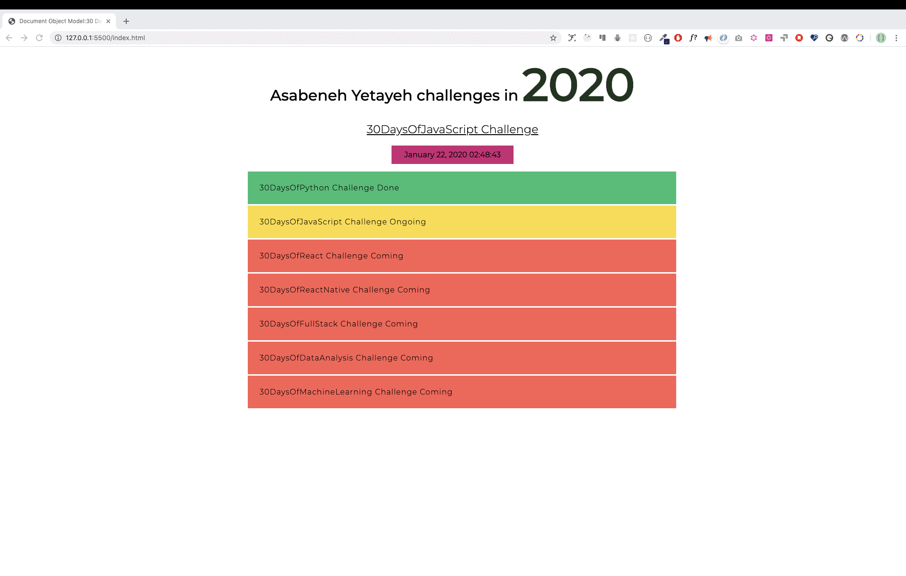
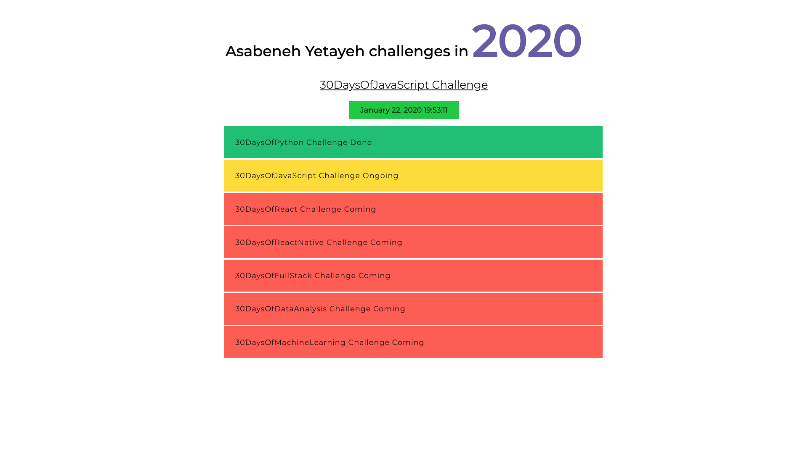

<div align="center">
<h1> 30 Günde JavaScript: Belge Nesne Modeli</h1>

<a class="header-badge" target="_blank" href="https://twitter.com/developerkhatai">

</a><br>

<sub>Yazar:
<a href="https://github.com/BilgeGates">Khatai Huseynzade</a><br>
<small>Mayıs, 2023</small>
</sub>

</div>
</div>

[<< Gün 20](../20_Gün_Temiz_Kod_Yazımı/20_gün_Temiz_Kod_Yazımı.md) | [Gün 22 >>](../22_Gün_DOM_Nesnesini_Değiştirme/22_gün_dom_nesnesini_değiştirme.md)

- [ 📔 Gün 21](#-Gün-21)
  - [Belge Nesne Modeli (DOM)](#Belge-Nesne-Modeli-DOM)
  - [Öğe Alınıyor](#Öğe-Alınıyor)
  - [Etiket Adına Göre Öğe Alma](#Etiket-Adına-Göre-Öğe-Alma)
  - [Sınıf Adına Göre Öğe Alma](#Sınıf-Adına-Göre-Öğe-Alma)
  - [Kimliğe Göre Öğe Alma](#Kimliğe-Göre-Öğe-Alma)
  - [queryselector Yöntemlerini Kullanarak Öğeleri Alma](#queryselector-Yöntemlerini-Kullanarak-Öğeleri-Alma)
  - [Özellik Ekleniyor](#Özellik-Ekleniyor)
  - [setAttribute Kullanarak Öznitelik Ekleme](#setAttribute-Kullanarak-Öznitelik-Ekleme)
  - [setAttribute Olmadan Öznitelik Ekleme](#setAttribute-Olmadan-Öznitelik-Ekleme)
  - [classList Kullanarak Sınıf Ekleme](#classList-Kullanarak-Sınıf-Ekleme)
  - [Kaldır Kullanılarak Sınıf Kaldırmak](#Kaldır-Kullanılarak-Sınıf-Kaldırmak)
  - [HTML Öğesine Metin Ekleme](#HTML-Öğesine-Metin-Ekleme)
  - [textContent Kullanarak Metin İçeriği Ekleme](#textContent-Kullanarak-Metin-İçeriği-Ekleme)
  - [innerHTML Kullanarak Metin İçeriği Ekleme](#innerHTML-Kullanarak-Metin-İçeriği-Ekleme)
  - [Metin İçeriği](#Metin-İçeriği)
  - [İç HTML](#İç-HTML)
  - [Stil Ekleme](#Stil-Ekleme)
  - [Stil Rengi Ekleme](#Stil-Rengi-Ekleme)
  - [Stil Arka Plan Rengi Ekleme](#Stil-Arka-Plan-Rengi-Ekleme)
  - [Stil Yazı Tipi Boyutu Ekleme](#Stil-Yazı-Tipi-Boyutu-Ekleme)
- [💻 Gün 21: Egzersizleri](#-Gün-21-Egzersizleri)
  - [Egzersiz: Seviye 1](#Egzersiz-Seviye-1)
  - [Egzersiz: Seviye 2](#Egzersiz-Seviye-2)
  - [Egzersiz: Seviye 3](#Egzersiz-Seviye-3)
    - [Mini Prohje](#Mini-Proje)

# 📔 Gün 21

## Belge Nesne Modeli (DOM)

HTML belgesi bir JavaScript Nesnesi olarak yapılandırılmıştır. Her HTML öğesinin, onu değiştirmeye yardımcı olabilecek farklı özellikleri vardır. JavaScript kullanarak HTML öğelerini almak, oluşturmak, eklemek veya kaldırmak mümkündür. Aşağıdaki örnekleri kontrol edin. JavaScript kullanarak HTML öğesi seçmek, CSS kullanarak seçim yapmaya benzer. Bir HTML öğesi seçmek için etiket adını, kimliği, sınıf adını veya diğer nitelikleri kullanırız.

### Öğe Alma

JavaScript kullanarak zaten oluşturulmuş öğeye veya öğelere erişebiliriz. Öğelere erişmek veya öğeleri almak için farklı yöntemler kullanırız. Aşağıdaki kodda dört _h1_ öğesi vardır. _h1_ öğelerine erişmenin farklı yöntemlerini görelim.

```html
<!DOCTYPE html>
<html lang="tr">
  <head>
    <title>Belge Nesne Modeli</title>
  </head>
  <body>
    <h1 class="title" id="first-title">İlk Başlık</h1>
    <h1 class="title" id="second-title">İkinci Başlık</h1>
    <h1 class="title" id=" Third-title">Üçüncü Başlık</h1>
    <h1></h1>
  </body>
</html>
```

#### Öğeleri Etiket Adına Göre Alma

**_getElementsByTagName()_**: dize parametresi olarak bir etiket adı alır ve bu yöntem bir HTMLCollection nesnesi döndürür. Bir HTMLCollection, HTML öğelerinin bir dizi benzeri nesnesidir. length özelliği, koleksiyonun boyutunu sağlar. Bu yöntemi ne zaman kullanırsak kullanalım, tek tek öğelere indeks kullanarak veya her bir öğe aracılığıyla döngüden sonra erişiriz. Bir HTMLCollection tüm dizi yöntemlerini desteklemez, bu nedenle forEach yerine düzenli for döngüsü kullanmalıyız.

```js
// syntax
document.getElementsByTagName("tagname");
```

```js
const allTitles = document.getElementsByTagName("h1");

console.log(allTitles);
console.log(allTitles.length); // 4

for (let i = 0; i < allTitles.length; i++) {
  console.log(allTitles[i]);
}
```

#### Öğeleri Sınıf Adına Göre Alma

**_getElementsByClassName()_** yöntemi bir HTMLCollection nesnesi döndürür. Bir HTMLCollection, HTML öğelerinin listesi gibi bir dizidir. length özelliği, koleksiyonun boyutunu sağlar. Tüm HTMLCollection öğeleri arasında geçiş yapmak mümkündür. Aşağıdaki örneğe bakın

```js
// söz dizimi
Document.getElementsByClassName("sınıfadı");
```

```js
const allTitles = document.getElementsByClassName('başlık')

console.log(allTitles) // HTML Koleksiyonları
console.log(allTitles.length) // 4

için (i = 0 olsun; i < allTitles.length; i++) {
   console.log(allTitles[i]) // H
}
```

#### Kimliğe Göre Bir Eleman Alma

**_getElementsById()_**, tek bir HTML öğesini hedefler. Kimliği argüman olarak # olmadan iletiyoruz.

```js
// sözdizimi
Document.getElementById("id");
```

```js
firstTitle = document.getElementById('ilk başlık') olsun
console.log(firstTitle) // <h1>İlk Başlık</h1>
```

#### QuerySelector Yöntemlerini Kullanarak Öğeleri Alma

_document.querySelector_ yöntemi, etiket adına, kimliğe veya sınıf adına göre bir HTML veya HTML öğesi seçebilir.

**_querySelector_**: HTML öğesini etiket adı, kimliği veya sınıfına göre seçmek için kullanılabilir. Etiket adı kullanılırsa, yalnızca ilk öğeyi seçer.

##### İç HTML

Tamamen yeni bir alt içeriği bir üst öğeyle değiştirmek istediğimizde innerHTML özelliğini kullanırız.
Atadığımız değer, bir HTML öğeleri dizisi olacak.

```html
<!DOCTYPE html>
<html lang="tr">
   <head>
     <title>Belge Nesne Modeli</title>
   </head>
   </head>
     <div sınıfı="warpper">

   const ul = document.querySelector('ul')
   ul.innerHTML = listeler
     </>
   </body>
</html>
```

İç HTML özelliği, bir üst öğenin tüm alt öğelerini kaldırmamıza da izin verebilir. removeChild() kullanmak yerine aşağıdaki yöntemi tavsiye ederim.

```html
<!DOCTYPE html>
<html lang="en">
  <head>
    <title>30 Günde JavaScript</title>
  </head>
  <body>
    <div class="wrapper">
      <h1>2020'de Asabeneh Yetayeh meydan okumaları</h1>
      <h2>30 Günde JavaScript Yarışması</h2>
      <ul>
        <li>30 Günde Python Mücadelesi Tamamlandı</li>
        <li>30 Günde JavaScript Yarışması Devam Ediyor</li>
        <li>30 Günde React Meydan Okuması Geliyor</li>
        <li>30 Günde FullStack Yarışması Geliyor</li>
        <li>30 Günde Data Analizleri Yarışması Geliyor</li>
        <li>30 Günde React Natiuve Yarışması Geliyor</li>
        <li>30 Günde Makine Öğrenimi Yarışması Geliyor</li>
      </ul>
    </div>
    <script>
      const ul = document.querySelector("ul");
      ul.innerHTML = "";
    </script>
  </body>
</html>
```

### Stil Ekleme

#### Stil Rengi Ekleme

Başlıklarımıza biraz stil katalım. Elemanın çift indeksi varsa ona yeşil renk veririz, kırmızı veririz.

```js
const başlıkları = document.querySelectorAll('h1')
titles.forEach((başlık, i) => {
   title.style.fontSize = '24px' // tüm başlıklar 24px yazı tipi boyutuna sahip olacak
   eğer (i % 2 === 0) {
     title.style.color = 'yeşil'
   } başka {
     title.style.color = 'kırmızı'
   }
})
```

#### Stil Arka Plan Rengi Ekleme

Başlıklarımıza biraz stil katalım. Elemanın çift indeksi varsa ona yeşil renk veririz, kırmızı veririz.

```js
const başlıkları = document.querySelectorAll('h1')
titles.forEach((başlık, i) => {
   title.style.fontSize = '24px' // tüm başlıklar 24px yazı tipi boyutuna sahip olacak
   eğer (i % 2 === 0) {
     title.style.backgroundColor = 'yeşil'
   } başka {
     title.style.backgroundColor = 'kırmızı'
   }
})
```

#### Stil Yazı Tipi Boyutu Ekleme

Başlıklarımıza biraz stil katalım. Elemanın çift dizini varsa, ona 20 piksel, aksi halde 30 piksel veririz.

```js
const başlıkları = document.querySelectorAll('h1')
titles.forEach((başlık, i) => {
   title.style.fontSize = '24px' // tüm başlıklar 24px yazı tipi boyutuna sahip olacak
   eğer (i % 2 === 0) {
     title.style.fontSize = '20px'
   } başka {
     title.style.fontSize = '30px'
   }
})
```

Fark ettiğiniz gibi, JavaScript'te kullandığımız css'nin özellikleri bir camelCase olacaktır. Aşağıdaki CSS özellikleri, background-color'dan backgroundColor'a, font-size'den fontSize'a, font-family'den fontFamily'e, margin-bottom'dan marginBottom'a değişir.

🌕Artık tamamen bir süper güce sahipsin, challenge'ın ve genel olarak JavaScript'in en önemli ve zorlu kısmını tamamladın. DOM'u öğrendiniz ve artık uygulama oluşturma ve geliştirme yeteneğine sahipsiniz. Şimdi beyniniz ve kaslarınız için bazı egzersizler yapın.

## 💻 Gün 21: Egzersizleri

### Egzersiz: Seviye 1

1. Bir index.html dosyası oluşturun ve yukarıdaki gibi dört p öğesi koyun: **_document.querySelector(tagname)_** ve etiket adını kullanarak ilk paragrafı alın
2. **_document.querySelector('#id')_** kullanarak ve kimliklerine göre paragrafların her birini alın
3. **_document.querySelectorAll(tagname)_** kullanarak ve etiket adına göre tüm p'yi nodeList olarak alın
4. nodeList'te dolaşın ve her paragrafın metin içeriğini alın
5. Dördüncü paragraf,**_Fourth Paragraph_** paragrafına bir metin içeriği ayarlayın
6. Farklı öznitelik belirleme yöntemleri kullanarak tüm paragraflar için kimlik ve sınıf özniteliğini ayarlayın

### Egzersiz: Seviye 1

1. JavaScript kullanarak her paragrafın stilini değiştirin (ör. renk, arka plan, kenarlık, yazı tipi boyutu, yazı tipi ailesi)
1. Tüm paragrafları seçin ve her öğe arasında geçiş yapın ve birinci ve üçüncü paragrafa yeşil, ikinci ve dördüncü paragrafa kırmızı renk verin
1. Metin içeriğini, kimliği ve sınıfı her paragrafa ayarlayın

### Egzersiz: Seviye 1

#### Mini Proje

1. Aşağıdaki uygulamayı geliştirin, başlamak için aşağıdaki HTML öğelerini kullanın. Başlangıç klasöründe de aynı kodu alacaksınız. Tüm stilleri ve işlevleri yalnızca JavaScript kullanarak uygulayın.

   - Yıl rengi her 1 saniyede bir değişiyor
   - Tarih ve saat arka plan rengi her saniye değişiyor
   - Tamamlanan meydan okumanın arka planı yeşildir
   - Devam eden meydan okumanın arka planı sarıdır
   - Yaklaşan zorlukların arka planı kırmızıdır

```html
<!DOCTYPE html>
<html lang="en">
  <head>
    <title>30 Günde JavaScript</title>
  </head>
  <body>
    <div class="wrapper">
      <h1>2020'de Asabeneh Yetayeh meydan okumaları</h1>
      <h2>30 Günde JavaScript Yarışması</h2>
      <ul>
        <li>30 Günde Python Mücadelesi Tamamlandı</li>
        <li>30 Günde JavaScript Yarışması Devam Ediyor</li>
        <li>30 Günde React Meydan Okuması Geliyor</li>
        <li>30 Günde FullStack Yarışması Geliyor</li>
        <li>30 Günde Data Analizleri Yarışması Geliyor</li>
        <li>30 Günde React Natiuve Yarışması Geliyor</li>
        <li>30 Günde Makine Öğrenimi Yarışması Geliyor</li>
      </ul>
    </div>
  </body>
</html>
```





🎉 TEBRİKLER! 🎉

[<< Gün 20](../20_Gün_Temiz_Kod_Yazımı/20_gün_Temiz_Kod_Yazımı.md) | [Gün 22 >>](../22_Gün_DOM_Nesnesini_Değiştirme/22_gün_dom_nesnesini_değiştirme.md)
