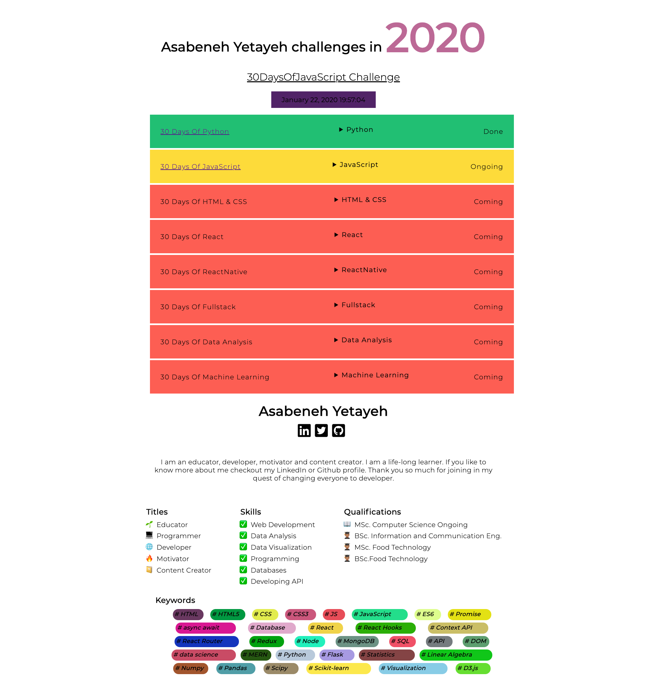

<div align="center">
<h1> 30 Günde JavaScript: Kapatma</h1>

[](https://github.com/BilgeGates)<br>

<sub>Çevirmen:
<a href="https://github.com/BilgeGates">Khatai Huseynzada</a><br>
<small>Mayıs, 2023</small>
</sub>

</div>
</div>

[<< Gün 21](../21_Gün_Belge_Nesne_Modeli/21_gün_belge_nesne_modeli.md) | [Gün 23 >>](../23_Gün_Olay_Tetikleyicileri/23_gün_olay_tetikleyicileri.md)

- [ 📔 Gün 22](#-Gün-22)
  - [Belge Nesne Modeli](#Belge-Nesne_Modeli)
    - [Element Oluşturma](#Element-Oluşturma)
      - [Metod: 1](#Metod-1)
      - [Metod: 2](#metod-2)
    - [Bir Üst Elemente child Elementi Ekleme](#Bir-Üst-Elemente-child-Elementi-Ekleme)
    - [Bir Üst Ebeveynin child Elementini Kaldırma](#Bir-Üst-Ebeveynin-child-Elementini-Kaldırma)
- [💻 Gün 22: Egzersizleri](#-Gün-22-Egzersizleri)
  - [Egzersiz: Seviye 1](#Egzersiz-Seviye-1)
  - [Egzersiz: Seviye 2](#Egzersiz-Seviye-2)
  - [Egzersiz: Seviye 3](#Egzersiz-Seviye-3)

# 📔 Gün 22

## Belge Nesne Modeli

### Element Oluşturma

#### Metod: 1

HTML element oluşturmak için iki metod kullana bilirsiniz. İndi ise ilk metodla tanış olalım.
İlk metodda etiket adını kullanırız. JavaScript kullanarak HTML element oluşturmak oldukça basittir . _document.createElement()_ metodunu kullanırız. Bu metod bir HTML element etiket adını string olarak alır.

```js
// syntax
document.createElement("tagname");
```

```html
<!DOCTYPE html>
<html>
  <head>
    <title>30 Günde JavaScript: Belge Nesne Modeli</title>
  </head>
  <body>
    <script>
      let title = document.createElement("h1");
      title.className = "title";
      title.style.fontSize = "24px";
      title.textContent = "Creating HTML element DOM Day 2";
      console.log(title);
    </script>
  </body>
</html>
```

#### Metod: 2

İkinci metodda ise birden fazla element oluşturmak için döngü kullanmalıyız. Döngü kullanarak istediğimiz kadar HTML elementi oluşturabiliriz.
Element oluşturduktan sonra, HTML nesnenin farklı özelliklerine değer atayabiliriz.

```html
<!DOCTYPE html>
<html>
  <head>
    <title>Belge Nesne Modeli</title>
  </head>
  <body>
    <script>
      let title;
      for (let i = 0; i < 3; i++) {
        title = document.createElement("h1");
        title.className = "title";
        title.style.fontSize = "24px";
        title.textContent = i;
        console.log(title);
      }
    </script>
  </body>
</html>
```

### Bir Üst Elemente child Elementi Ekleme

Oluşturduğumuz elementi HTML'de görmek için, üst element olarak child olarak eklememiz gerekir. HTML'de body'sine _document.body_ ile erişebiliriz. _document.body_ _appendChild()_ metodunu destekler. Aşağıdaki örneğe bakın.

```html
<!DOCTYPE html>
<html>
  <head>
    <title>Belge Nesne Modeli</title>
  </head>
  <body>
    <script>
      // creating multiple elements and appending to parent element
      let title;
      for (let i = 0; i < 3; i++) {
        title = document.createElement("h1");
        title.className = "title";
        title.style.fontSize = "24px";
        title.textContent = i;
        document.body.appendChild(title);
      }
    </script>
  </body>
</html>
```

### Bir Üst Ebeveynin child Elementini Kaldırma

HTML oluşturduktan sonra, element veya elementleri kaldırmak isteyebiliriz ve _removeChild()_ metodunu kullanabiliriz.

**Örnek:**

```html
<!DOCTYPE html>
<html lang="en">
  <head>
    <title>DOM Nesnesini Değiştirme</title>
  </head>
  <body>
    <div class="wrapper">
      <h1>2020'de Khatai Huseynzada meydan okumaları</h1>
      <h2>30 Günde JavaScript Yarışması</h2>
      <ul>
        <li>30 Günde Python Mücadelesi Tamamlandı</li>
        <li>30 Günde JavaScript Yarışması Devam Ediyor</li>
        <li>30 Günde React Meydan Okuması Geliyor</li>
        <li>30 Günde FullStack Yarışması Geliyor</li>
        <li>30 Günde Data Analizleri Yarışması Geliyor</li>
        <li>30 Günde React Natiuve Yarışması Geliyor</li>
        <li>30 Günde Makine Öğrenimi Yarışması Geliyor</li>
      </ul>
    </div>
    <script>
      const ul = document.querySelector("ul");
      const lists = document.querySelectorAll("li");
      for (const list of lists) {
        ul.removeChild(list);
      }
    </script>
  </body>
</html>
```

Önceki bölümde gördüğümüz gibi, bir üst elementin tüm iç HTML elementlerini veya child elementleri _innerHTML_ metodu ve özelliklerini kullanarak ortadan kaldırmak için daha iyi bir yol mevcut.

```html
<!DOCTYPE html>
<html>
  <head>
    <title>DOM Nesnesini Değiştirme</title>
  </head>
  <body>
    <div class="wrapper">
      <h1>2020'de Khatai Huseynzada meydan okumaları</h1>
      <h2>30 Günde JavaScript Yarışması</h2>
      <ul>
        <li>30 Günde Python Mücadelesi Tamamlandı</li>
        <li>30 Günde JavaScript Yarışması Devam Ediyor</li>
        <li>30 Günde React Meydan Okuması Geliyor</li>
        <li>30 Günde FullStack Yarışması Geliyor</li>
        <li>30 Günde Data Analizleri Yarışması Geliyor</li>
        <li>30 Günde React Natiuve Yarışması Geliyor</li>
        <li>30 Günde Makine Öğrenimi Yarışması Geliyor</li>
      </ul>
    </div>
    <script>
      const ul = document.querySelector("ul");
      const lists = document.querySelectorAll("li");
      for (const list of lists) {
        ul.removeChild(list);
      }
    </script>
  </body>
</html>
```

🌕 Çok özel birisin, her gün ilerliyorsun. Şimdi, ihtiyaç duyduğunda oluşturulmuş bir DOM elementini nasıl yok edeceğini biliyorsun. DOM'u öğrendin ve şimdi uygulamaları inşa etme ve geliştirme becerisine sahipsin. Öğrenme yolunda sadece sekiz gün kaldı. Şimdi beynin ve kasların için bazı egzersizler yap.

## 💻 Gün 22: Egzersizleri

### Egzersiz: Seviye 1

1. HTML belgesinde bir div kapsayıcısı oluşturun ve dinamik olarak 0 ila 100 sayılar oluşturun ve kapsayıcı div'e ekleyin.
   - Çift sayıların arka planı yeşil
   - Tek sayılar arka planı sarı
   - Prime numaraları arka planı kırmızı


### Egzersiz: Seviye 2

1. Ülkeler dizisini kullanarak tüm ülkeleri görüntüleyin. Tasarımı görün.


### Egzersiz: Seviye 3

Bu projenin gereksinimlerini jpg ve gif görüntülerinden her ikisinden de kontrol edin. Tüm veri ve CSS, yalnızca JavaScript kullanılarak uygulanmıştır. Veri starter klasörü proje*3'de bulunmaktadır. [\_Açılır menü*](https://www.w3schools.com/tags/tag_details.asp) düğmesi detaylar HTML öğesi kullanılarak oluşturulmuştur.




🎉 Tebrikler ! 🎉

[<< Gün 21](../21_Gün_Belge_Nesne_Modeli/21_gün_belge_nesne_modeli.md) | [Gün 23 >>](../23_Gün_Olay_Tetikleyicileri/23_gün_olay_tetikleyicileri.md)
