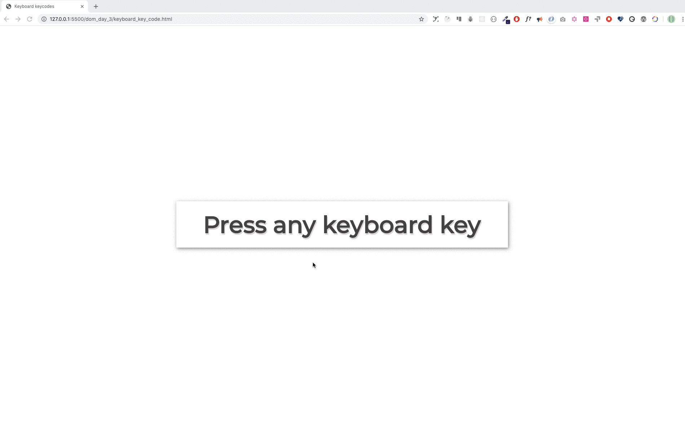

<div align="center">
<h1> 30 Günde JavaScript: Olay Tetikleyicileri</h1>

<a class="header-badge" target="_blank" href="https://twitter.com/developerkhatai">

</a><br>

<sub>Çevirmen:
<a href="https://github.com/BilgeGates">Khatai Huseynzade</a><br>
<small>Mayıs, 2023</small>
</sub>

</div>
</div>

[<< Gün 22](../22_Gün_DOM_Nesnesini_Değiştirme/22_gün_dom_nesnesini_değiştirme.md) | [Gün 24 >>](../24_Gün_Mini_Proje_Güneş_Sistemi/24_gün_mini_proje_güneş_sistemi.md)

- [ 📔 Gün 23](#-Gün-23)
  - [Olay Tetikleyicileri](#Olay-Tetikleyicileri)
    - [Tıklama](#Tıklama)
    - [Çift tıklama](#Çift-Tıklama)
    - [Maus Tıklaması](#Maus-Tıklaması)
    - [Bir input öğesinden değer alma](#Bir-input-Öğesinden-Değer-Alma)
    - [input Değeri](#input-Değeri)
      - [input Olayı ve deyişdirme Olayı](#input-Olayı-ve-Deyiştirme-Olayı)
      - [Bulanlılık Olayı](#Blanlılık-Olayı)
      - [keypress, keydown ve keyup](#keypress-keydown-ve-kyup)
  - [💻 Gün 23: Egzersizleri](#-Gün-23-Egzersizleri)
    - [Egzersiz: Seviye 1](#Egzersiz-Seviye-1)

# 📔 Gün 23

## Olay Tetikleyicileri

Ortak HTML olayları: tıklama, değişiklik, fare üzerine gelme, fareyi elementin üzerinden çıkarma, tuşa basma, tuştan el çekme, yükleme.

Herhangi bir DOM nesnesine olay dinleyici yöntemi ekleyebiliriz. HTML öğelerinde farklı olay türlerini dinlemek için **addEventListener()** yöntemini kullanırız. _addEventListener()_ yöntemi, bir olay dinleyicisi ve geri çağırma işlevi olmak üzere iki argüman alır.

```js
selectedElement.addEventListener("eventlistner", function (e) {
  // olaydan sonra olmasını istediğiniz aktivite burada olacak
});
// or

selectedElement.addEventListener("eventlistner", (e) => {
  // olaydan sonra olmasını istediğiniz aktivite burada olacak
});
```

#### Tıklama

Bir öğeye olay dinleyicisi eklemek için önce öğeyi seçer, ardından **addEventListener()** yöntemini ekleriz. Olay dinleyicisi, olay türünü ve geri çağırma işlevlerini argüman olarak alır.

Aşağıdaki örnek tıklama türü olayın bir örneğidir.

**Örnek: Tıklama**

```html
<!DOCTYPE html>
<html>
  <head>
    <title>Belge Nesne Modeli</title>
  </head>
  <body>
    <button>Bana tıkla</button>
    <script>
      const button = document.querySelector("button");
      button.addEventListener("click", (e) => {
        console.log("e gives the event listener object:", e);
        console.log("e.target gives the selected element: ", e.target);
        console.log(
          "e.target.textContent gives content of selected element: ",
          e.target.textContent
        );
      });
    </script>
  </body>
</html>
```

Bir olay, doğrudan HTML öğesine satır içi komut dosyası olarak da eklenebilir.

**Örnek: onclick**

```html
<!DOCTYPE html>
<html>
  <head>
    <title>Belge Nesne Modeli</title>
  </head>

  <body>
    <button onclick="clickMe()">Click Me</button>
    <script>
      const clickMe = () => {
        alert("We can attach event on HTML element");
      };
    </script>
  </body>
</html>
```

#### Çift Tıklama

Bir öğeye olay dinleyicisi eklemek için önce öğeyi seçeriz, ardından **addEventListener()** yöntemini ekleriz. Olay dinleyicisi, olay türünü ve geri çağırma işlevlerini argüman olarak alır.

Aşağıdaki örnek, tıklama türü olayın bir örneğidir.

**Örnek: dblclick**

```html
<!DOCTYPE html>
<html>
  <head>
    <title>Belge Nesne Modeli</title>
  </head>
  <body>
    <button>Bana tıkla</button>
    <script>
      const button = document.querySelector("button");
      button.addEventListener("dblclick", (e) => {
        console.log("e gives the event listener object:", e);
        console.log("e.target gives the selected element: ", e.target);
        console.log(
          "e.target.textContent gives content of selected element: ",
          e.target.textContent
        );
      });
    </script>
  </body>
</html>
```

#### Maus Tklaması

Bir öğeye olay dinleyicisi eklemek için önce öğeyi seçeriz, ardından **addEventListener()** yöntemini ekleriz. Olay dinleyicisi, olay türünü ve geri çağırma işlevlerini argüman olarak alır.

Aşağıdaki örnek, tıklama türündeki bir olayın örneğidir.

**Örnek: mouseenter**

```html
<!DOCTYPE html>
<html>
  <head>
    <title>Belge Nesne Modeli</title>
  </head>
  <body>
    <button>Bana tıkla</button>
    <script>
      const button = document.querySelector("button");
      button.addEventListener("mouseenter", (e) => {
        console.log("e gives the event listener object:", e);
        console.log("e.target gives the selected element: ", e.target);
        console.log(
          "e.target.textContent gives content of selected element: ",
          e.target.textContent
        );
      });
    </script>
  </body>
</html>
```

Şimdiye kadar `addEventListener` yöntemini ve olay dinleyicisi nasıl ekleyeceğimizi öğrendiniz. Birçok olay dinleyicisi türü vardır ancak burada en önemli ve sık kullanılan olaylara odaklanacağız.

Olay listesi:

- `click` - eleman tıklandığında
- `dblclick` - eleman çift tıklandığında
- `mouseenter` - fare noktası öğeye girdiğinde
- `mouseleave` - fare işaretçisi öğeden ayrıldığında
- `mousemove` - fare işaretçisi öğe üzerinde hareket ettiğinde
- `mouseover` - fare işaretçisi öğe üzerinde hareket ettiğinde
- `mouseout` - fare işaretçisi öğeden dışarı çıktığında
- `input` - değer giriş alanına girildiğinde
- `change` - giriş alanında değer değiştiğinde
- `blur` - öğe odaklanmadığında
- `keydown` - bir tuş düştüğünde
- `keyup` - bir anahtar bittiğinde
- `keypress` - herhangi bir tuşa bastığımızda
- `onload` - tarayıcı bir sayfayı yüklemeyi bitirdiğinde

Yukarıdaki kod örneğindeki olay türünü değiştirerek yukarıdaki olay türlerini test edebilirsiniz.

### Bir input Öğesinden Değer Alma

Genellikle form doldururuz ve formlar verileri işler. Form alanları, girdi HTML öğesi kullanılarak oluşturulur. İki girdi alanı, bir düğme ve bir `p` etiketi kullanarak bir kişinin vücut kitle indeksini hesaplamamıza izin veren küçük bir uygulama oluşturalım.

### input Değeri

```html
<!DOCTYPE html>
<html>
  <head>
    <title>30 Günde JavaScript: Belge Nesne Modeli</title>
  </head>
  <body>
    <h1>Vücut Kitle İndeksi Hesaplayıcı</h1>
    <input type="text" id="mass" placeholder="Mass in Kilogram" />
    <input type="text" id="height" placeholder="Height in meters" />
    <button>Calculate BMI</button>
    <script>
      const mass = document.querySelector("#mass");
      const height = document.querySelector("#height");
      const button = document.querySelector("button");
      let bmi;
      button.addEventListener("click", () => {
        bmi = mass.value / height.value ** 2;
        alert(`your bmi is ${bmi.toFixed(2)}`);
        console.log(bmi);
      });
    </script>
  </body>
</html>
```

#### input Olayı ve Değiştirme Olayı

Yukarıdaki örnekte, iki girdi alanından verileri düğmeye tıklayarak almayı başardık. Ancak, düğmeye tıklamadan değer almak isterseniz, girdi alanına odaklandığında verileri hemen almak için _change_ veya _input_ olay türünü kullanabiliriz. Bunu nasıl ele alacağımızı görelim.

```html
<!DOCTYPE html>
<html>
  <head>
    <title>30 Günde JavaScript: Belge Nesne Modeli</title>
  </head>
  <body>
    <h1>Giriş veya değişiklik olayı kullanarak veri bağlama</h1>
    <input type="text" placeholder="say something" />
    <p></p>
    <script>
      const input = document.querySelector("input");
      const p = document.querySelector("p");

      input.addEventListener("input", (e) => {
        p.textContent = e.target.value;
      });
    </script>
  </body>
</html>
```

#### Blanlılıl Olayı

_Input_ veya _change_ olaylarının aksine, `blur` olayı girdi alanına odaklı değilken meydana gelir.

```js
<!DOCTYPE html>
<html>
<head>
    <title>30 Günde JavaScript: Belge Nesne Modeli</title>
</head>
<body>
    <h1>Blur olayını kullanarak geri bildirim verme</h1>
    <input type="text" id="mass" placeholder="say something" />
    <p></p>
    <script>
        const input = document.querySelector('input')
        const p = document.querySelector('p')
        input.addEventListener('blur', (e) => {
            p.textContent = 'Field is required'
            p.style.color = 'red'
        })
    </script>
</body>
</html>
```

#### keypress, keydown ve keyup

`keypress`, `keydown`, `keyup` her üç sözcükde _tuşa basma_ menasını veriyor.

Farklı olay dinleyici türlerini kullanarak klavyenin tüm tuş numaralarına erişebiliriz. `KeyPress`'i kullanalım ve her klavye tuşunun keyCode'unu alalım.

```html
<!DOCTYPE html>
<html>
  <head>
    <title></title>
  </head>
  <body>
    <h1>Önemli olaylar: Herhangi bir tuşa basın</h1>
    <script>
      document.body.addEventListener("keypress", (e) => {
        alert(e.keyCode);
      });
    </script>
  </body>
</html>
```

---

🌕 Sen çok özel birisin, her gün gelişiyorsun. Artık herhangi bir DOM olayını nasıl ele alacağını biliyorsun. Başarıya giden yolda yalnızca yedi günün kaldı. Şimdi tüm bunları pekiştirmen için alıştırma vakti!

## 💻 Gün 23: Egzersizleri

### Egzersiz: Seviye 1

1. Üç farklı renkle çift, tek ve asal sayıları işaretleyen sayıları oluşturma. Aşağıdaki resme bakın.


2. Klavye kodunu dinleyici kullanarak oluşturma. Aşağıdaki resme bakın.



🎉 TEBRİKLER ! 🎉

[<< Gün 22](../22_Gün_DOM_Nesnesini_Değiştirme/22_gün_dom_nesnesini_değiştirme.md) | [Gün 24 >>](../24_Gün_Mini_Proje_Güneş_Sistemi/24_gün_mini_proje_güneş_sistemi.md)
