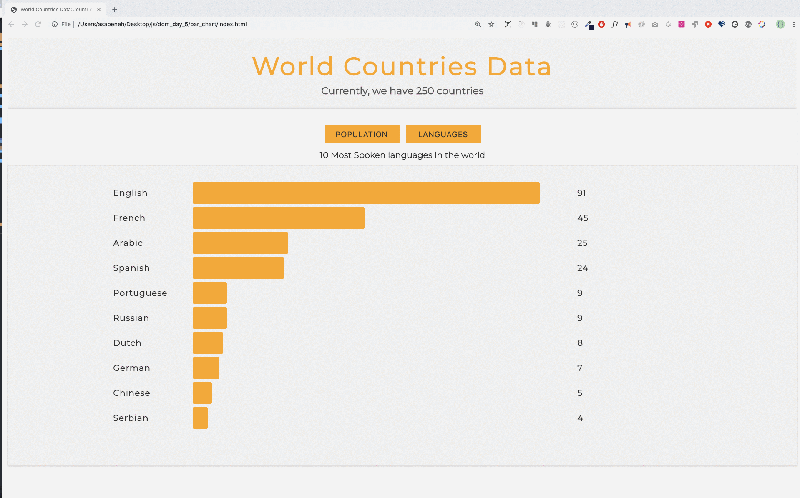

<h1>30 Günde JavaScript: Mini Proje: Dünya Ülkeleri Veri Görselleştirme: 1 </h1>

 

Çevirmen:
<a href="https://github.com/BilgeGates">Khatai Huseynzade</a> 
<small> Mayıs, 2023</small>

[<< Gün 24](../24_Gün_Proje_Güneş_Sistemi/24_gün_proje_güneş_sistemi.md) | [Gün 26 >>](../26_Gün_Mini_Proje_Dünya_Ülkeleri_Veri_Görselleştirme_2/26_gün_mini_proje_dünya_ülkeleri_veri_görselleştirme_2.md)

- [📔 Gün 25](#-Gün-25)
- [💻 Gün 25: Egzersizleri](#-Gün-25-Egzersizleri)
  - [Egzersiz: Seviye 1](#Egzersiz-Seviye-1)

# 📔 Gün 25

## 💻 Gün 25: Egzersizleri

### Egzersiz: Seviye 1

1. Dünya'da en çok nüfusa sahip on ülkeyi ve en çok konuşulan on dilin görselleştirilmesi için DOM (HTML, CSS, JS) kullanarak küçük bir uygulama geliştirin.

🎉 TEBRİKLER ! 🎉

[<< Gün 24](../24_Gün_Proje_Güneş_Sistemi/24_gün_proje_güneş_sistemi.md) | [Gün 26 >>](../26_Gün_Mini_Proje_Dünya_Ülkeleri_Veri_Görselleştirme_2/26_gün_mini_proje_dünya_ülkeleri_veri_görselleştirme_2.md)
