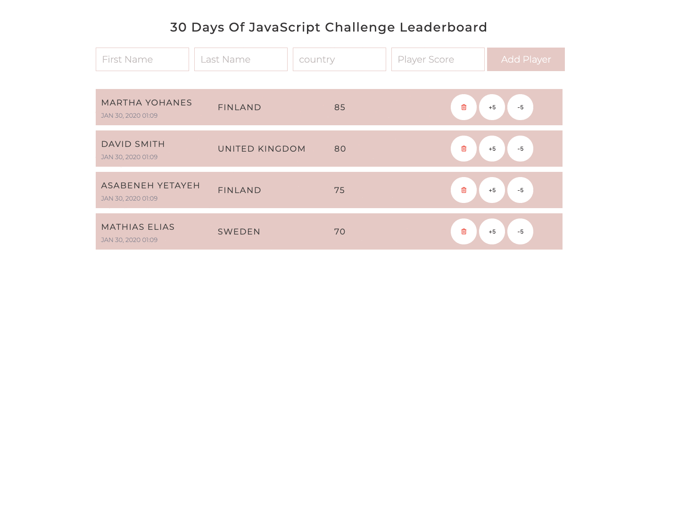

<h1>30 Günde JavaScript: Mini Proje: Liderler Sıralaması </h1>

 

Çevirmen:
<a href="https://github.com/Asabeneh">Asabeneh Yetayeh</a> 
<small> Mayıs, 2023</small>

[<< Gün 27](../27_Gün_Mini_Proje_Portföy/27_gün_mini_proje_portföy.md) | [Gün 29 >>](../29_Gün_Mini_Proje_Animasyon_Karakterleri/29_gün_mini_proje_animasyon_karakterleri.md)

- [📔 Gün 28](#-Gün-28)
- [💻 Gün 28: Egzersizleri](#-Gün-28-Egzersizleri)
  - [Egzersiz: Seviye 1](#Egzersiz-Seviye-1)

# 📔 Gün 28

## 💻 Gün 28: Egzersizleri

### Egzersiz: Seviye 1

1. HTML, CSS ve JavaScript kullanarak aşağıdakini oluşturun.

🎉 TEBRİKLER ! 🎉

[<< Gün 27](../27_Gün_Mini_Proje_Portföy/27_gün_mini_proje_portföy.md) | [Gün 29 >>](../29_Gün_Mini_Proje_Animasyon_Karakterleri/29_gün_mini_proje_animasyon_karakterleri.md)
