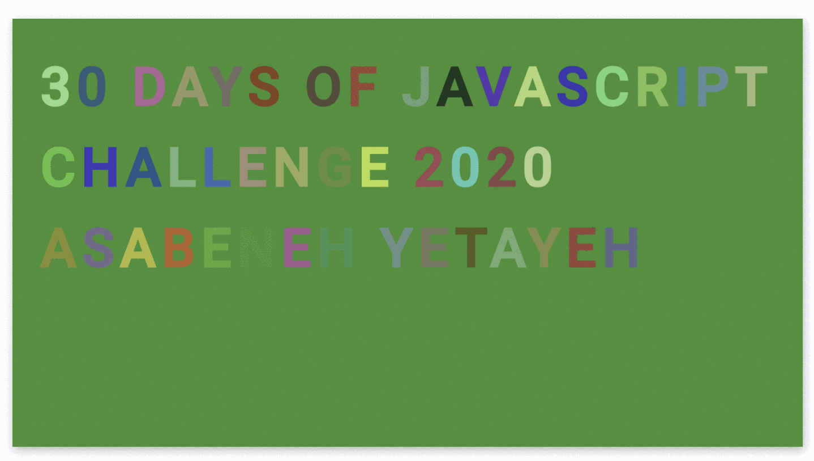

  <h1> 30 Günde JavaScript: Animasyon Karakterleri</h1>
  
  

Yazar:
<a href="https://www.linkedin.com/in/asabeneh/" target="_blank">Asabeneh Yetayeh</a> 
Çevirmen:
<a href="https://github.com/BilgeGates" target="_blank">Khatai Huseynzade</a> 
<small> Mart, 2023</small>

[<< Gün 28](./28_Gün_Mini_Proje_Liderler_Sıralaması/28_gün_mini_proje_liderler_sıralaması.md) | [Gün 30>>](./30_Gün_Mini_Proje_Finalı/30_gün_mini_proje_finalı.md)

- [Gün 29](#Gün-29)
  - [💻Gün 29: Egzersizler](#Egzersizler)
    - [Egzersiz: Seviye 1](#Egzersiz-Seviye-1)

# Gün 29

## 💻Gün 29: Egzersizler

### Egzersiz: Seviye 1

1. Şu animasyonu HTML, CSS, JS kullanarak oluşturun.

🎉 TEBRİKLER ! 🎉

[<< Gün 28](./28_Gün_Mini_Proje_Liderler_Sıralaması/28_gün_mini_proje_liderler_sıralaması.md) | [Gün 30>>](./30_Gün_Mini_Proje_Finalı/30_gün_mini_proje_finalı.md)
