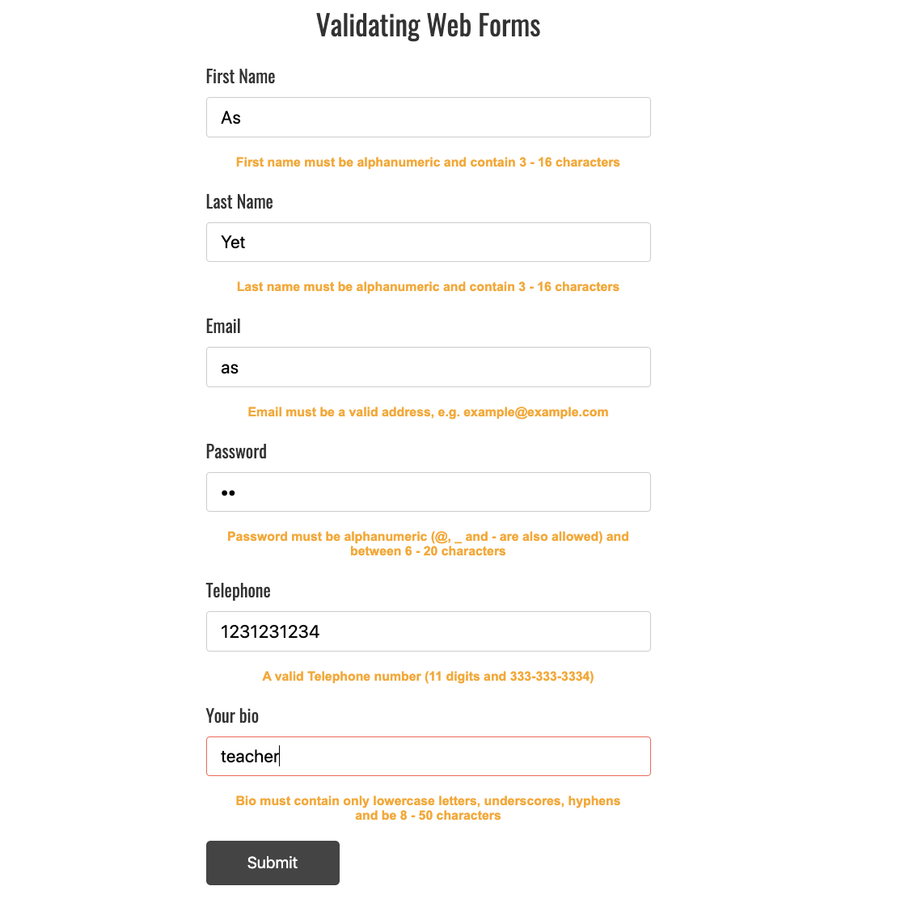

<h1>30 Günde JavaScript: Mini Proje Finalı</h1>

 

Çevirmen:
<a href="https://github.com/BilgeGates">Khatai Huseynzada</a> 
<small> Mayıs, 2023</small>

[<< Gün 29](../29_Gün_Mini_Proje_Animasyon_Karakterleri/29_gün_mini_proje_animasyon_karakterleri.md)

- [📔 Gün 30](#-Gün-30)
  - [Mükemmelsin](#Mükemmelsin)
- [💻 Gün 30: Egzersizleri](#-Gün-30-Egzersizleri)
  - [Egzersiz: Seviye 1](#Egzersiz-Seviye-1)
  - [Egzersiz: Seviye 2](#Egzersiz-Seviye-2)

# 📔 Gün 30

Artık 30 Günlük JavaScript Programlama Diline yekun vurdunuz! Şimdi ise son proje ile ilgilenek!

## 💻 Gün 30: Egzersizleri

### Egzersiz: Seviye 1

1. Regex kullanarak aşağıdaki formu doğrulayın.

   

   

### Egzersiz: Seviye 1

1. (HTML, CSS, JS) kullanarak aşağıdaki animasyonu oluşturun

## Mükemmelsin!

🌕 Harika bir başarıya imza attınız! Yücelik yolculuğunuzda sona geldiniz ve yüksek bir seviyeye ulaştınız. Artık öncekinden daha büyük ve daha güçlüsünüz. Bu seviyeye gelmenin ne kadar zor olduğunu biliyorum ve siz bu noktaya ulaşarak gerçek bir kahraman oldunuz. Şimdi ise başarınızı sevdiklerinizle kutlama zamanı geldi! Sizden başka zorluklarla dolu yeni bir yolculukta görüşmek üzere.

[<< Gün 29](../29_Gün_Mini_Proje_Animasyon_Karakterleri/29_gün_mini_proje_animasyon_karakterleri.md)
